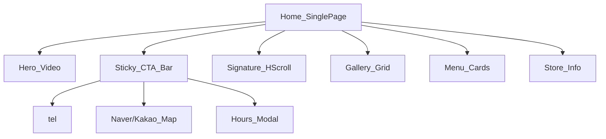

# 장어명가 진 — 모바일 PWA 설계서

> 작성: restaurant-designer + restaurant-developer 협업 스펙  
> 리소스: [`../res2/`](../res2/) (14 WebP + 3 MP4, 합계 ~12MB)

---

## 1. 프로젝트 목표

| 항목 | 내용 |
|------|------|
| 대상 | 모바일 방문객 (카카오톡·네이버 검색 유입) |
| 목적 | **전화 예약·찾아오기·메뉴 확인** 3가지를 10초 안에 |
| 형태 | 설치 가능한 정적 PWA |
| 톤 | 숯불 장어 — 다크·웜·프리미엄 한식 |

---

## 2. res2 리소스 맵

### 영상 (히어로 전용)

| 파일 | 용도 |
|------|------|
| `KakaoTalk_20260615_143228643-web.mp4` | 히어로 1순위 (3.6MB) |
| `KakaoTalk_20260615_143517655-web.mp4` | 히어로 2순위 (2.1MB, 가장 가벼움) |
| `KakaoTalk_20260615_150616256-web.mp4` | 히어로 3순위 (5.1MB) |

- 히어로: **2번 영상 기본** → 스크롤 시 또는 8초 간격 순환
- `poster`: `KakaoTalk_20260615_151043674_05.webp` (가로, 고해상도)

### 사진 — 가로 8장 (갤러리·메뉴 카드)

`151043674.webp`, `_02`, `_04`, `_05`, `_07`, `_08`, `_13` + 메인

- **시그니처 가로 스크롤** (`scroll-snap-type: x mandatory`)
- 메뉴 카드 썸네일 (가로 crop `object-fit: cover`)

### 사진 — 세로 6장 (풀폭 스토리)

`_01`, `_03`, `_06`, `_09`, `_10`, `_11`, `_12`

- **세로 풀폭 카드** `aspect-ratio: 3/4`
- 갤러리 그리드 2열 (작은 화면에서 Pinterest 느낌)

```text
[ 히어로 영상 + 식당명 ]
[ 전화 | 지도 | 영업시간 ]  ← sticky 하단 바
[ 시그니처 가로 스크롤 4~5장 ]
[ "오늘의 장어" 세로 카드 2열 ]
[ 메뉴 카드 3~4종 ]
[ 매장 정보 ]
[ 갤러리 나머지 ]
```

---

## 3. 정보 구조 (IA)



**단일 페이지 스크롤** — 탭/햄버거 메뉴 없음 (모바일 트렌드: friction 최소화)

---

## 4. 비주얼 시스템

### 컬러 (CSS 변수)

```css
:root {
  --color-bg: #0f0f0f;
  --color-surface: #1a1612;
  --color-accent: #c9a227;      /* 장어 소스·숯불 골드 */
  --color-accent-dim: #8b6914;
  --color-text: #f5f0e8;
  --color-text-muted: #a89f8f;
  --color-border: #2a2420;
  --color-overlay: rgba(15, 12, 8, 0.55);
}
```

### 타이포

- 제목: `Pretendard` / `Apple SD Gothic Neo` — 700
- 본문: 400, 15px, line-height 1.6
- 가격: accent color, 18px bold

### 간격·터치

- 섹션 padding: `24px 16px`
- 카드 gap: `12px`
- 최소 터치 영역: `48px`
- 하단 CTA bar 높이: `64px` + `safe-area-inset-bottom`

---

## 5. 섹션 상세

### 5.1 Hero (100dvh max 640px)

- 배경: `<video>` 순환, `object-fit: cover`
- 오버레이: gradient `transparent → --color-bg`
- 콘텐츠 (하단 정렬):
  - 식당명: **「장어명가 진」**
  - 한 줄 카피: *「숯불에 구운 국내산 장어」*
  - 스크롤 힌트 chevron

### 5.2 Sticky CTA Bar (fixed bottom)

| 버튼 | 아이콘 | 동작 |
|------|--------|------|
| 전화 | 📞 | `tel:` |
| 오시는 길 | 📍 | 카카오맵/네이버맵 외부 링크 |
| 영업시간 | 🕐 | 바텀시트 토글 |

- `z-index: 100`, blur backdrop `backdrop-filter: blur(12px)`

### 5.3 Signature Horizontal Scroll

- 가로 사진 5장: `05, 02, 04, 08, 13`
- 카드 너비: `85vw`, `scroll-snap-align: center`
- 캡션 없음 (사진이 메인)

### 5.4 Gallery Grid (세로 6 + 나머지)

- CSS Grid: `grid-template-columns: 1fr 1fr`
- 세로 사진 우선 배치
- 탭 시 **라이트박스** (fullscreen, swipe dismiss)

### 5.5 Menu Cards

리소스만으로 메뉴명 확정 불가 → **메뉴판 이미지 + JSON 카테고리**

| 구분 | 항목 |
|------|------|
| 장어 | 소금 28,000 / 양념 30,000 |
| 식당 | 갈비살·장어탕·칼국수 등 (`data/menu.json`) |
| 주류 | 소주·맥주·복분자 등 |
| 상차림 | 대인 4,000 / 소인 2,000 |

- **메뉴판 전체**: `media/menu-board.png` 탭 시 확대
- 대표 메뉴 카드: 소금·양념 장어구이 (res2 사진)

### 5.6 Store Info

```json
{
  "name": "장어명가 진",
  "phone": "033-374-3140",
  "mobile": "010-5364-3140",
  "address": "강원도 영월군 영월읍 팔괴로 32-20번지",
  "hours": "11:30 - 21:30",
  "mapUrl": "https://map.kakao.com/..."
}
```

- 지도: 외부 링크 버튼 (iframe 지도는 PWA에서 무거움)

---

## 6. PWA·성능

| 항목 | 스펙 |
|------|------|
| manifest | `short_name: "a장어"`, `theme_color: #0f0f0f`, `display: standalone` |
| 캐시 | 앱 셸 + media lazy cache |
| LCP | 히어로 poster + 가장 작은 영상(143517655) 우선 |
| 영상 | 히어로 외 autoplay 금지 |

---

## 7. 데이터 스키마

### `data/restaurant.json`

매장 기본 정보 (전화·주소·지도·영업)

### `data/gallery.json`

```json
{
  "signature": ["media/KakaoTalk_..._05.webp", "..."],
  "grid": ["media/KakaoTalk_..._01.webp", "..."],
  "heroPoster": "media/KakaoTalk_..._05.webp"
}
```

### `data/menu.json`

```json
{
  "items": [
    { "id": "m1", "name": "장어구이 (소)", "price": null, "priceLabel": "가격 문의", "image": "media/..." }
  ]
}
```

### `data/videos.json`

```json
{
  "hero": [
    { "src": "media/..._143517655-web.mp4", "poster": "media/..._05.webp" },
    { "src": "media/..._143228643-web.mp4", "poster": "media/..._05.webp" }
  ]
}
```

---

## 8. 구현 단계 (개발자용)

1. `res2/` → `restaurant/public/media/` 복사
2. `data/*.json` 작성 (placeholder 정보 → 사장님 확인 후 교체)
3. Vite+TS+PWA 스캐폴딩
4. 섹션 순 구현: Hero → CTA → Signature → Menu → Gallery → Info
5. 라이트박스·바텀시트
6. 로컬 `npm run dev` → 실기기 테스트
7. (배포는 별도 단계)

---

## 9. 사장님 확인 필요

- [x] 식당 정식 명칭 — **장어명가 진**
- [x] 전화번호 — **033-374-3140** / **010-5364-3140**
- [x] 주소 — **강원도 영월군 영월읍 팔괴로 32-20번지**
- [x] 메뉴·가격 — 메뉴판 이미지 반영 (`data/menu.json`)
- [ ] 영업시간·휴무일 (현재 placeholder)
- [ ] 대표 카피 문구 확정

---

## 10. 에이전트 협업

| 에이전트 | 담당 |
|----------|------|
| `restaurant-designer` | DESIGN.md 갱신, 비주얼·UX 결정 |
| `restaurant-developer` | 코드·JSON·미디어 경로 구현 |

슬래시 커맨드 없이 에이전트명으로 호출: `/agents` → 선택
